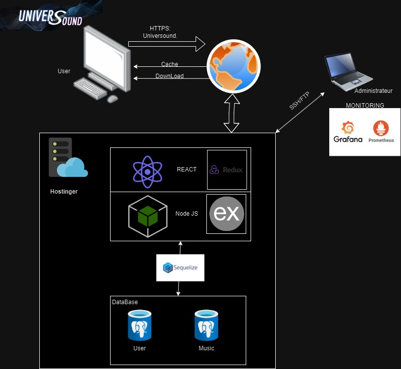

# Architecture

When a User Accesses the UniverSound site ([universound.ddns.net](http://universound.ddns.net/)) and wishes to listen to music; the site returns this either by caching, or with a local download for offline listening. All the information on the site is hosted by "Hostinger" (which avoids having to manage all the firewall, application server and server redundancy aspects). The Databases are created with "PostgreSQL". The Frontend will be created under "REACT" with the "Redux" container. The Backend will be managed via Node JS and Express JS. We use "Sequelize" (ORM) to make the link between the Databases and the site as such. Finally, the Administration/Monitoring part of the site will be done with "Prometheus" and the graphic interface "Grafana".