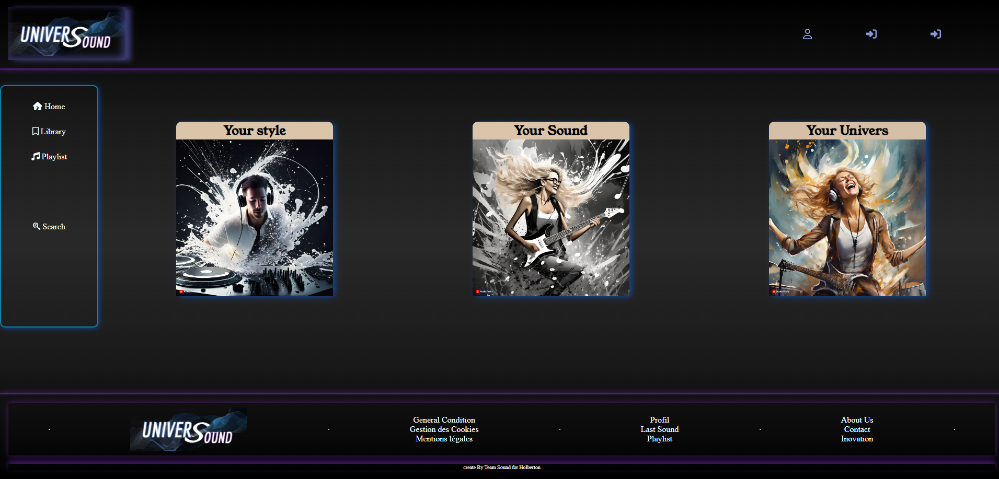

# UniverSound

## Your Style, Your Sound, Your Univers

## #Task 1

## —Target—

Today, the algorithm for music is oriented towards musical style (rap, R&B, rock...) or listening preference.

I propose to create a new algorithm with a new vision of the user's needs.

- the lexical field
- the rhythm

For example:

When I listen “sans repère” of Sniper, I want:

- lexical field proposition “Mon vieux” of Daniel Guichard
- rhythm like “ ( the better is one agorythm for define)”

## —Idee—

## 4 box of propositions

| Music listen
by user | Same style  | Same lexical field | Same rhythm |
| --- | --- | --- | --- |

## MVP specification

[Team ](Readme/Team%20532cb458ca9344b08b677eab6206e098.md)

[Technologies](Readme/Technologies%20dc3863ac683342758a92bfc4cce80792.md)

[Challenge](Readme/Challenge%205a5be665e9e54adf9f12e8c15c415077.md)

[Infrastructure](Readme/Infrastructure%202757e841b40444658b6afe86557c2db7.md)

[Existing Solutions](Readme/Existing%20Solutions%20b9b79b006a2f4ace89c6a0e6812ac584.md)

[Architecture](Readme/Architecture%20178418720df140f4b183b53987360459.md)

[APIs and Methods](Readme/APIs%20and%20Methods%20c670052d09f74d549f0086393adc27a1.md)

[Data Model](Readme/Data%20Model%2005349baae49a4c26a2c51f79764878e7.md)

[User Stories](Readme/User%20Stories%2009f6ca34f51945bfaac6ff27df6de581.md)

[Mockups](Readme/Mockups%2021c5d27b84864d3f829cb9032deffb57.md)

[Planification](Readme/Planification%206b190712e079453aa1037dfb697ac75d.md)

[Landing Page](Readme/Landing%20Page%20f6456d5c0bfa49aea99dbc7f0c666a76.md)