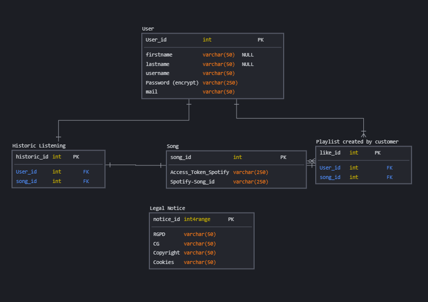
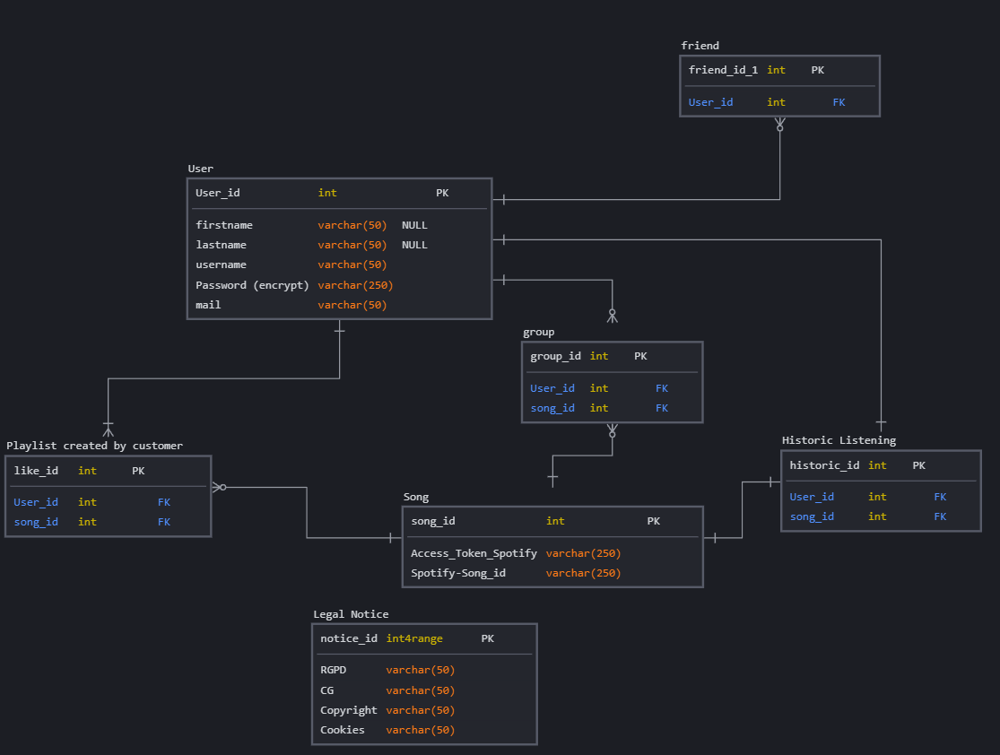
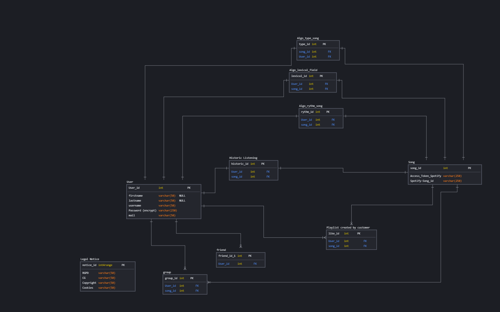

# Data Model

We wish to use the PostgreSQL database initially to manage all of our data. We want to have a scalable database depending on the progress of the project. First of all, the management of user accounts and the ability to broadcast music. Then, enhance the system with a possibility of offline listening. Finally, implement all the algorithms for correlating the different music by genre, their lyrics, their rhythm…

## Step 1:

For the first step, we create four databases: "customer", "music" and "legal_notice".

## Step 2:

In step 2, social_interaction.

## Step 3:

Finally, the third step involves implementing the necessary algorithms so that the music is related to each other, in order to offer a listening offer adapted to the user.

