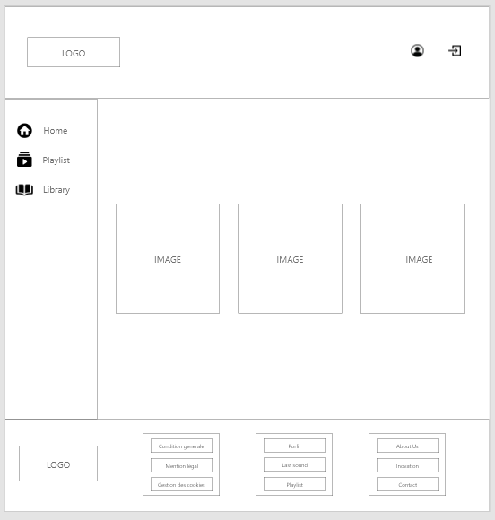
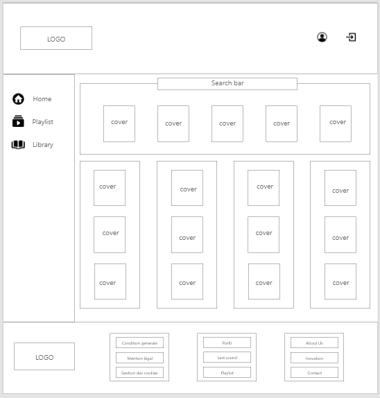
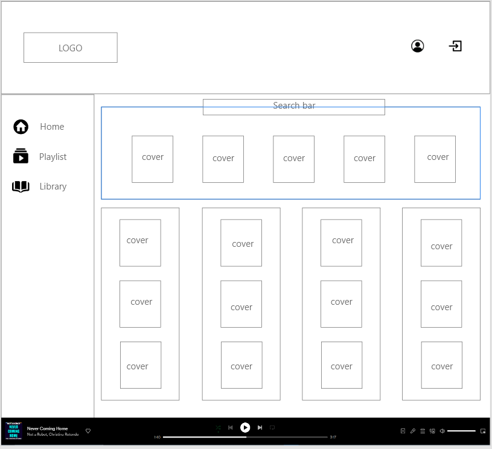
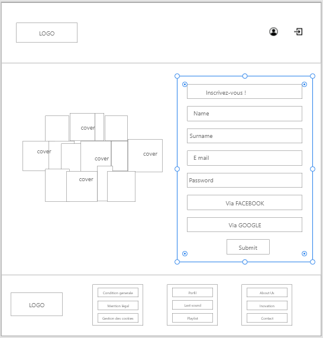
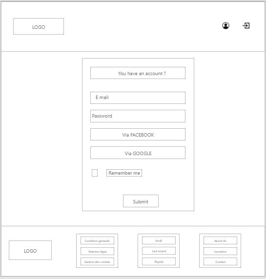

# Mockups

## Loading Page

Purpose: Promotes asynchronous loading of the rest of the site

How does it work?

The logo follows a dynamic to-and-fro movement, accompanied by a soundtrack of a falling heart.

## Welcome Page

Purpose : Presentation page

How does it work?

A click anywhere on the page leads to the login page except footer

Three decorative thumbnails with keywords (SEO)

The footer retains the proposed navigation (RGPD, CG...)

## Sound Page without player

Purpose: personalised, customisable environment

How it works:

Generates access to preferences and user listening area.

Accessible after login.

## Sound Page without player

## Sign-up Page

Purpose: Enhance the user experience and account creation.

How it works :

Allows users to interact with short soundtracks via the mosaic.

Allows the user to validate their registration.

Allows the user to access their account.

## Sign-in Page

Purpose: Access to the account

How it works :

enter in a field user email and password

